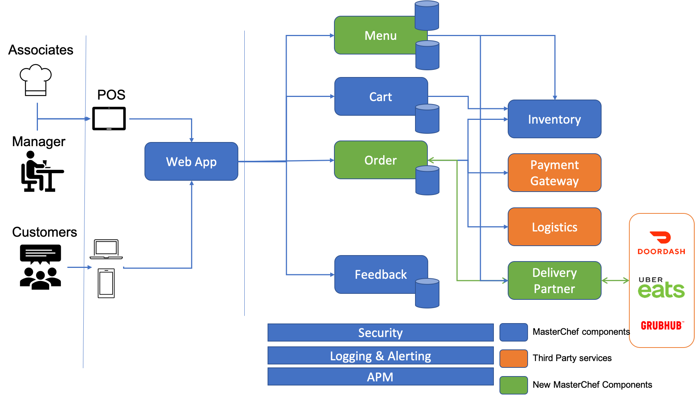

# e-staurant

## Introduction

e-staurant is an online restaurant which offers food delivery and carry out services. The state-of-the-art technology enables a great customer experience. e-staurant has its own ordering website.

A simple research performed using Google Trends shows 2X increase in the number of searches for delivery partners such as Ubereats , Dordash and Grubhub since the post-pandemic lockdown. e-staurant integrates seamlessly with delivery partners such as Grubhub, Door Dash &amp; Uber Eats for customer convenience &amp; for making the business viable.

## Design Details

The application is designed to provide an omni channel experience. The APIs power the web application and it serves as the one-stop-shop for both ordering and managing the business activities such as updating menu items / inventory etc.

**Note:** Components highlighted in green are added to support delivery partners to make the business more viable post pandemic.

The application supports the following types of user persona –

- Customers – place / track delivery and carry out orders using the web application.
- Manager – update menu / inventory in the system.
- Associates – Key in phone orders, view online orders and update order status via POS.
- Delivery Partners – Notify orders received from customers and pull order status information.

The system comprises of a front end that works with a variety of devices. The front-end is powered by the microservices listed below.

- Menu Service – This service allows users (managers) to perform CRUD operations on menu items & allows customers to view menu items to be added to the cart. The data is stored in a persistent backend datastore and frequently accessed data along with user specific recommendations are cached in a caching data store. This microservice also updates the delivery partners to ensure data consistency.
- Cart Service – This service creates the cart entity which manages the customer&#39;s shopping cart. The cart is stored in a persistent store and is associated with a user. The menu items reference ids are added to a list along with their quantity. The implementation handles price lookup by calling the menu service to return the price to user.
- Order Service – This service manages the order lifecycle and manages orders placed via all the different channels (direct customer, POS , external partners). This service also interfaces with other services such as inventory to update the inventory after an order is successfully fulfilled or cancelled, payment gateway to process the customer payment and logistics service to handle delivery
- Inventory Service – This service is used to manage the restaurant inventory.
- Feedback Service – This service persists the customer feedback and returns the feedback to be shown on the web application.
- Delivery Partner Service – Accepts new orders from delivery partners and calls Order Service to persist the order in the order store. This service also provides an endpoint for the partners to query the status of a specific order.

Below are the endpoints exposed by the different services –

| **Service** | **HTTP Method** | **Endpoints** |
| --- | --- | --- |
| Menu | GET | /masterchef/v1/menuitems |
| Menu | GET | /masterchef/v1/menuitems?itemtype={itemtype} |
| Menu | GET | /masterchef/v1/menuitems/{id} |
| Menu | POST | /masterchef/v1/menuitems |
| Menu | PUT | /masterchef/v1/menuitems/{id} |
| Menu | DELETE | /masterchef/v1/menuitems/{id} |
| Cart | GET | /masterchef/v1/carts/{id} |
| Cart | GET | /masterchef/v1/carts?userid={userid} |
| Cart | POST | /masterchef/v1/carts |
| Cart | PUT | /masterchef/v1/carts/{id} |
| Cart | DELETE | /masterchef/v1/carts/{id} |
| Inventory | GET | /masterchef/v1/inventory |
| Inventory | GET | /masterchef/v1/inventory/{id} |
| Inventory | PUT | /masterchef/v1/inventory/reserve |
| Inventory | DELETE | /masterchef/v1/inventory/{id} |
| Order | GET | /masterchef/v1/orders/{id} |
| Order | GET | /masterchef/v1/orders/userid={userid} |
| Order | GET | /masterchef/v1/orders?status={orderstatus} |
| Order | POST | /masterchef/v1/orders |
| Order | PUT | /masterchef/v1/orders/{id} |
| Feedback | GET | /masterchef/v1/feedback |
| Feedback | GET | /masterchef/v1/feedback?orderid={orderid} |
| Feedback | GET | /masterchef/v1/feedback?rating={rating} |
| Feedback | GET | /masterchef/v1/feedback?startdate={startdate}&amp;enddate={enddate} |
| Feedback | POST | /masterchef/v1/feedback |
| Feedback | PUT | /masterchef/v1/feedback/{id} |
| Feedback | DELETE | /masterchef/v1/feedback/{id} |
| Delivery Partner | GET | /masterchef/v1/externalorders?partnerid={partnerid}&amp;orderid={orderid} |
| Delivery Partner | PUT | /masterchef/v1/externalorders/{orderid} |

## Run the service locally

1. Clone the service
2. mvn spring-boot:run

## Swagger Endpoints

1. After starting the application locally , access [http://localhost:8080/swagger-ui/index.html?configUrl=/api-docs/swagger-config#/](http://localhost:8080/swagger-ui/index.html?configUrl=/api-docs/swagger-config#/)